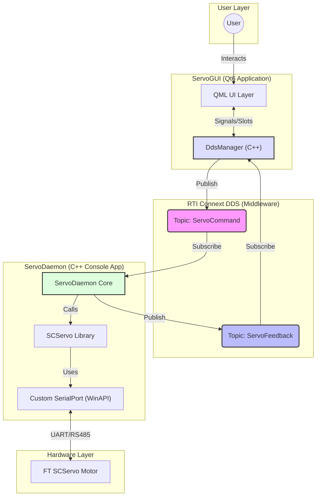
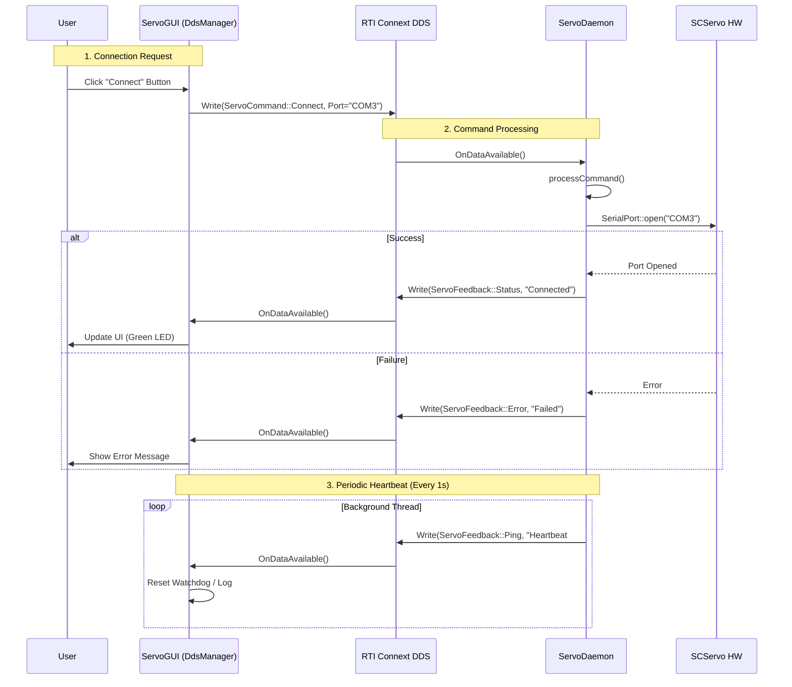

# System Architecture

## Overview
The **FT SCServo Qt6 DDS Control** system is designed with a decoupled architecture to ensure stability, scalability, and responsiveness. It consists of two main applications communicating via **RTI Connext DDS**.

1.  **ServoGUI**: A Qt6/QML-based user interface for control and monitoring.
2.  **ServoDaemon**: A robust C++ console application handling hardware communication and real-time control.

---

## Architecture Diagram

The following diagram illustrates the high-level architecture and data flow between components.



---

## Data Flow (Sequence)

This sequence diagram depicts the flow of a **Connect** command and the periodic **Heartbeat** mechanism.



---

## Component Details

### 1. ServoGUI (Qt6)
*   **Main.qml**: Defines the visual layout using Qt Quick Controls 2. Handles user input (buttons, sliders) and displays status.
*   **DdsManager**: A C++ class inheriting `QObject`.
    *   Exposes `sendConnect()`, `sendPing()` to QML.
    *   Updates QML properties (`status`, `messages`) upon receiving DDS data.
    *   Implements a Watchdog to detect Daemon disconnection if Heartbeats stop.

### 2. ServoDaemon (C++)
*   **ServoDaemon**: The core class managing the application lifecycle.
    *   Initializes DDS participants/writers/readers.
    *   Maintains a `run()` loop for periodic tasks (Heartbeat).
    *   Implements `processCommand()` to dispatch incoming requests.
*   **SCServo Library**:
    *   `SMS_STS`: Protocol implementation for SCServo.
    *   `SCSerial`: Handles packet serialization.
*   **SerialPort**:
    *   A custom, lightweight C++ wrapper around Windows API (`CreateFile`, `ReadFile`, `WriteFile`) to avoid Qt dependencies in the Daemon.

### 3. DDS Topics (IDL)
Defined in `scservo.idl`:

*   **ServoCommand** (GUI → Daemon):
    | command_type | Description | Parameters |
    |--------------|-------------|------------|
    | `connect` | Open serial port | `port_name`, `baud_rate` |
    | `disconnect` | Close serial port | - |
    | `ping` | Test DDS link | `value` (ping ID) |
    | `shutdown` | Stop daemon | - |
    | `scan` | Scan for servos (ID 1-253) | - |
    | `read_state` | Read servo status | `servo_id` |
    | `write_pos` | Single servo position | `servo_id`, `value`, `speed`, `acc` |
    | `sync_write_pos` | Multi-servo position | `target_ids`, `value`, `speed`, `acc` |
    | `write` | Write to memory | `servo_id`, `address`, `value`, `size` |
    | `enable_torque` | Enable/Disable torque | `servo_id`, `value` (0/1) |

*   **ServoFeedback** (Daemon → GUI):
    | feedback_type | Description | Data |
    |---------------|-------------|------|
    | `pong` | Response to ping | `message` |
    | `status` | Connection status | `connected`, `current_port` |
    | `ping` | Heartbeat (1s) | `message` |
    | `error` | Error notification | `message`, `is_error=true` |
    | `scan_result` | Scan complete | `found_ids[]` |
    | `servo_state` | Servo telemetry | `state.position, speed, load, voltage, temperature, current` |
    | `ack` | Command acknowledgment | `message` |

*   **ServoState** (embedded in ServoFeedback):
    *   `id`: Servo ID
    *   `position`: Current position (0-4095)
    *   `speed`: Current speed
    *   `load`: Motor load (0-1000)
    *   `voltage`: Voltage (0.1V unit)
    *   `temperature`: Temperature (°C)
    *   `current`: Current (mA)

---

## Directory Structure

```
/
├── daemon/             # Daemon Source Code
│   ├── servo/          # SCServo Control Library
│   ├── SerialPort.hpp  # Custom Serial Port Wrapper
│   ├── ServoDaemon.hpp # Main Daemon Logic
│   └── main.cpp        # Entry Point
├── gui/                # Qt GUI Source Code
│   ├── DdsManager.hpp  # DDS Bridge for QML
│   └── main.cpp        # Qt Entry Point
├── gen/                # RTI DDS Generated Code (IDL)
├── scservo.idl         # DDS Interface Definition
├── Main.qml            # GUI Layout
├── build.ps1           # Build Script
└── run.ps1             # Execution Script
```
