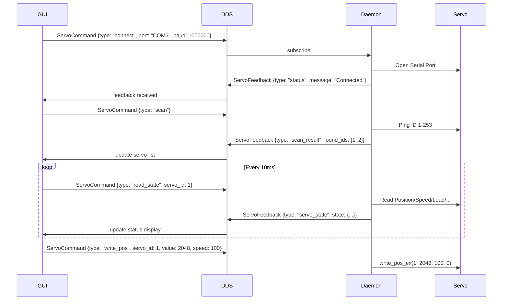

# GUI 구현 요구사항

> **Reference**: [dgmz/feetech-servo-tool](https://github.com/dgmz/feetech-servo-tool)  
> Python port of FT_SCServo_Debug_Qt, cross-platform 지원

---

## 📋 개요

FT SCServo Qt6 DDS 프로젝트의 GUI는 **2개의 주요 탭**으로 구성됩니다:
1. **Debug (Main) Tab** - 서보 제어, 실시간 모니터링, 오토 디버그
2. **Programming Tab** - 서보 메모리 설정 및 구성

---

## 🎨 레이아웃 구조

```
┌─────────────────────────────────────────────────────────────────────────┐
│  FT SCServo Tool                                              [_][□][X] │
├─────────────────────────────────────────────────────────────────────────┤
│  ┌─────────────────────────────────────┐  ┌──────────────────────────┐  │
│  │ COM Settings                        │  │ Servo List               │  │
│  │ [COM Port ▼] [Baud Rate ▼]          │  │ ┌────────────────────┐   │  │
│  │ [Timeout: ___] [Open/Close]         │  │ │ ID │ Module        │   │  │
│  └─────────────────────────────────────┘  │ ├────┼───────────────┤   │  │
│                                           │ │ 1  │ ST3215        │   │  │
│                                           │ │ 2  │ ST3215        │   │  │
│                                           │ └────────────────────┘   │  │
│                                           │ [Search] [Stop]          │  │
│                                           └──────────────────────────┘  │
├─────────────────────────────────────────────────────────────────────────┤
│  [Debug] [Programming]                                                  │
├─────────────────────────────────────────────────────────────────────────┤
│                                                                         │
│  (Tab Content Area - See below for each tab)                            │
│                                                                         │
└─────────────────────────────────────────────────────────────────────────┘
```

---

## 🔌 1. COM 설정 영역 (공통)

### 1.1 UI 요소

| 요소 | 타입 | 기본값 | 설명 |
|------|------|--------|------|
| COM Port | ComboBox | 자동 감지 | 사용 가능한 시리얼 포트 목록 |
| Baud Rate | ComboBox | 1000000 | 1000000, 500000, 250000, 115200, 57600, 38400, 19200, 9600 |
| Timeout | LineEdit | 50 | 응답 대기 시간 (ms), 범위: 0-10000 |
| Parity | ComboBox | NONE | NONE, ODD, EVEN (disabled) |
| Open/Close | Button | "Open" | 연결/해제 토글 |

### 1.2 동작

- **포트 자동 갱신**: 1초마다 사용 가능한 COM 포트 스캔 (연결 전)
- **연결 시**: 포트/Baud/Timeout 설정 비활성화, 버튼 "Close"로 변경
- **연결 해제 시**: 설정 활성화, 버튼 "Open"으로 변경

---

## 📋 2. 서보 리스트 영역 (공통)

### 2.1 UI 요소

| 요소 | 타입 | 설명 |
|------|------|------|
| Servo List | TableView | 2열 (ID, Module), 단일 선택 |
| Search/Stop | Button | 검색 시작/중지 토글 |
| Status Text | Label | "Ping ID:1 Servo..." 또는 "Stop" |

### 2.2 동작

- **Search 클릭**: ID 1~253 순차 핑, 응답 있으면 리스트에 추가
- **서보 선택**: 해당 서보 ID를 현재 제어 대상으로 설정
- **모델 자동 감지**: 모델 번호로 시리즈 (SMS_STS/SCS) 판별

---

## 🎮 3. Debug (Main) Tab

### 3.1 레이아웃

```
┌─────────────────────────────────────────────────────────────────────────┐
│ ┌───────────────────────────────┐  ┌──────────────────────────────────┐ │
│ │ Servo Control                 │  │ Status Monitor                   │ │
│ │                               │  │ Position: 2048                   │ │
│ │ Mode: ○Write ○Sync ○Reg      │  │ Goal:     2048                   │ │
│ │                               │  │ Torque:   0                      │ │
│ │ Goal:  [____] ◄══════════════►│  │ Speed:    0                      │ │
│ │ Speed: [____]                 │  │ Current:  0 mA                   │ │
│ │ Acc:   [____]                 │  │ Temp:     26 °C                  │ │
│ │ Time:  [____]                 │  │ Voltage:  5.0 V                  │ │
│ │                               │  │ Moving:   No                     │ │
│ │ [Set] [☑ Torque Enable]       │  └──────────────────────────────────┘ │
│ │ [Action] (RegWrite only)      │                                       │
│ └───────────────────────────────┘                                       │
├─────────────────────────────────────────────────────────────────────────┤
│ ┌───────────────────────────────┐  ┌──────────────────────────────────┐ │
│ │ Auto Debug                    │  │ Data Analysis                    │ │
│ │                               │  │                                  │ │
│ │ Start: [____] End: [____]     │  │ File: [~/servo_log.csv]          │ │
│ │ Sweep Delay: [____] ms        │  │ Interval: [10] ms                │ │
│ │ Step: [____] Delay: [____]    │  │ Size: 0                          │ │
│ │                               │  │                                  │ │
│ │ [Sweep] [Step]                │  │ [Export/Stop] [Clear]            │ │
│ └───────────────────────────────┘  └──────────────────────────────────┘ │
├─────────────────────────────────────────────────────────────────────────┤
│ ┌─────────────────────────────────────────────────────────────────────┐ │
│ │ Real-time Graph                                                     │ │
│ │                                                                     │ │
│ │  [☑ Position] [☑ Torque] [☑ Speed] [☑ Current] [☑ Temp] [☑ Voltage] │ │
│ │                                                                     │ │
│ │     ^^^^^^^^^^^^^^^^^^^^^^^^^^^^^^^^^^^^^^^^^^^^^^^^^^^^^^^^^^^^^^ │ │
│ │     Position ────────                                               │ │
│ │     Torque   ........                                               │ │
│ │                                                                     │ │
│ │  Up Limit: [____]  Down Limit: [____]                               │ │
│ │  Horizontal: ◄══════════════► Zoom: ◄══════════════►                │ │
│ └─────────────────────────────────────────────────────────────────────┘ │
└─────────────────────────────────────────────────────────────────────────┘
```

### 3.2 Servo Control 영역

#### 3.2.1 UI 요소

| 요소 | 타입 | 범위 | 설명 |
|------|------|------|------|
| Mode | RadioButtons | Write/Sync/Reg | 쓰기 모드 선택 |
| Goal | LineEdit + Slider | -32768 ~ 32767 | 목표 위치 |
| Speed | LineEdit | 0 ~ 4294967295 | 속도 |
| Acc | LineEdit | 0 ~ 4294967295 | 가속도 (SMS_STS) |
| Time | LineEdit | 0 ~ 4294967295 | 시간 (SCS) |
| Torque Enable | CheckBox | On/Off | 토크 활성화 |
| Set | Button | - | 목표값 전송 |
| Action | Button | - | RegWrite 실행 (Reg 모드 전용) |

#### 3.2.2 동작

- **Slider 이동**: 실시간으로 Goal 전송 (현재 Mode에 따라)
- **Set 클릭**: Goal/Speed/Acc/Time 값을 서보에 전송
- **Torque Enable**: 토크 활성화/비활성화
- **Action**: RegWrite 모드에서 Buffered 명령 실행

### 3.3 Status Monitor 영역

| 항목 | 업데이트 주기 | 설명 |
|------|-------------|------|
| Position | 10ms | 현재 위치 (0-4095) |
| Goal | 30ms | 목표 위치 |
| Torque | 10ms | 토크/Load (0-1000) |
| Speed | 10ms | 현재 속도 |
| Current | 10ms | 전류 (mA) |
| Temp | 30ms | 온도 (°C) |
| Voltage | 30ms | 전압 (V) |
| Moving | 30ms | 움직임 상태 (Yes/No) |

### 3.4 Auto Debug 영역

| 요소 | 설명 |
|------|------|
| Start/End | 위치 범위 (0-4095) |
| Sweep Delay | Sweep 간격 (ms) |
| Step | 스텝 크기 |
| Step Delay | 스텝 간격 (ms) |
| Sweep | Start↔End 연속 왕복 |
| Step | Start→End 스텝 이동 후 역방향 |

### 3.5 Data Analysis 영역

| 요소 | 설명 |
|------|------|
| File | 저장 경로 (default: ~/servo_log.csv) |
| Interval | 기록 간격 (ms) |
| Size | 기록된 데이터 개수 |
| Export/Stop | CSV 기록 시작/중지 |
| Clear | 데이터 초기화 |

**CSV 형식**:
```csv
"No","Pos","Goal","Torque","Speed","Current","Temp","Voltage"
1,2048,2048,0,0,0,26,50
```

### 3.6 Real-time Graph 영역

| 요소 | 설명 |
|------|------|
| Series CheckBoxes | 표시할 데이터 시리즈 선택 |
| Up/Down Limit | Y축 상하한 |
| Horizontal Slider | X축 스크롤 |
| Zoom Slider | X축 확대/축소 |

---

## ⚙️ 4. Programming Tab

### 4.1 레이아웃

```
┌─────────────────────────────────────────────────────────────────────────┐
│ ┌─────────────────────────────────────────────────────────────────────┐ │
│ │ Memory Table                                                        │ │
│ │ ┌─────────┬───────────────────────┬───────┬───────┬───────┐         │ │
│ │ │ Address │ Memory                │ Value │ Area  │ R/W   │         │ │
│ │ ├─────────┼───────────────────────┼───────┼───────┼───────┤         │ │
│ │ │ 3       │ Model Number L        │ 0     │ EPROM │ R     │         │ │
│ │ │ 4       │ Model Number H        │ 3     │ EPROM │ R     │         │ │
│ │ │ 5       │ ID                    │ 1     │ EPROM │ R/W   │         │ │
│ │ │ 6       │ Baud Rate             │ 0     │ EPROM │ R/W   │         │ │
│ │ │ ...     │ ...                   │ ...   │ ...   │ ...   │         │ │
│ │ │ 56      │ Present Position L    │ 0     │ SRAM  │ R     │         │ │
│ │ │ 57      │ Present Position H    │ 8     │ SRAM  │ R     │         │ │
│ │ └─────────┴───────────────────────┴───────┴───────┴───────┘         │ │
│ └─────────────────────────────────────────────────────────────────────┘ │
├─────────────────────────────────────────────────────────────────────────┤
│ ┌─────────────────────────────────────────────────────────────────────┐ │
│ │ Memory Edit                                                         │ │
│ │                                                                     │ │
│ │ Selected: [ID]                                                      │ │
│ │ Value:    [___] [Set]                                               │ │
│ └─────────────────────────────────────────────────────────────────────┘ │
└─────────────────────────────────────────────────────────────────────────┘
```

### 4.2 Memory Table

| 열 | 설명 |
|----|------|
| Address | 메모리 주소 |
| Memory | 레지스터 이름 |
| Value | 현재 값 (실시간 업데이트) |
| Area | EPROM / SRAM |
| R/W | 읽기 전용(R) / 읽기쓰기(R/W) |

### 4.3 Memory Edit

| 요소 | 설명 |
|------|------|
| Selected | 선택된 레지스터 이름 |
| Value | 새 값 입력 (R/W일 때만 활성화) |
| Set | 값 쓰기 |

### 4.4 특수 처리

- **ID 변경 (Address 5)**: Lock 해제(55=0) → ID 쓰기 → Lock 설정(55=1)

---

## 📦 메모리 맵 (SMS_STS)

### EPROM (읽기 전용)

| Address | Name | Size |
|---------|------|------|
| 3-4 | Model Number | 2 |

### EPROM (읽기/쓰기)

| Address | Name | Size | Default |
|---------|------|------|---------|
| 5 | ID | 1 | 1 |
| 6 | Baud Rate | 1 | 0 |
| 9-10 | Min Angle Limit | 2 | 0 |
| 11-12 | Max Angle Limit | 2 | 4095 |
| 26 | CW Dead | 1 | 0 |
| 27 | CCW Dead | 1 | 0 |
| 31-32 | Offset | 2 | 0 |
| 33 | Mode | 1 | 0 |

### SRAM (읽기/쓰기)

| Address | Name | Size |
|---------|------|------|
| 40 | Torque Enable | 1 |
| 41 | Acceleration | 1 |
| 42-43 | Goal Position | 2 |
| 44-45 | Goal Time | 2 |
| 46-47 | Goal Speed | 2 |
| 48-49 | Torque Limit | 2 |
| 55 | Lock | 1 |

### SRAM (읽기 전용)

| Address | Name | Size |
|---------|------|------|
| 56-57 | Present Position | 2 |
| 58-59 | Present Speed | 2 |
| 60-61 | Present Load | 2 |
| 62 | Present Voltage | 1 |
| 63 | Present Temperature | 1 |
| 66 | Moving | 1 |
| 69-70 | Present Current | 2 |

---

## 🔄 DDS 통신 흐름



---

## 🚀 구현 우선순위

### Phase 1: 기본 기능 (필수)
1. ✅ COM 설정 및 연결/해제
2. ✅ 서보 스캔 및 리스트 표시
3. 🔲 Servo Control (Goal Slider + Set)
4. 🔲 Status Monitor (실시간 상태 표시)
5. 🔲 Torque Enable

### Phase 2: 고급 제어
6. 🔲 Write Mode 선택 (Write/Sync/Reg)
7. 🔲 Auto Debug (Sweep/Step)
8. 🔲 Real-time Graph

### Phase 3: 설정 및 분석
9. 🔲 Programming Tab (Memory Table)
10. 🔲 Memory Edit
11. 🔲 Data Analysis (CSV Export)

### Phase 4: 완성도
12. 🔲 설정 저장/불러오기
13. 🔲 다국어 지원
14. 🔲 About 다이얼로그

---

## 📁 파일 구조 (예정)

```
gui/
├── Main.qml                 # 메인 윈도우
├── components/
│   ├── ComSettings.qml      # COM 설정 컴포넌트
│   ├── ServoList.qml        # 서보 리스트 컴포넌트
│   ├── ServoControl.qml     # 서보 제어 컴포넌트
│   ├── StatusMonitor.qml    # 상태 모니터 컴포넌트
│   ├── AutoDebug.qml        # 오토 디버그 컴포넌트
│   ├── DataAnalysis.qml     # 데이터 분석 컴포넌트
│   ├── RealTimeGraph.qml    # 실시간 그래프 컴포넌트
│   ├── MemoryTable.qml      # 메모리 테이블 컴포넌트
│   └── MemoryEdit.qml       # 메모리 편집 컴포넌트
├── DdsManager.hpp           # DDS 통신 관리자
├── DdsManager.cpp
└── main.cpp
```

---

## 📌 참고 사항

1. **DDS 분리 아키텍처**: GUI와 Daemon이 분리되어 있으므로, 모든 서보 통신은 DDS를 통해 수행
2. **Qt Quick/QML**: 모던 UI 구현을 위해 QML 사용 (Widgets 아님)
3. **크로스 플랫폼**: Windows/Linux/macOS 지원 목표
4. **SMS_STS 시리즈 우선**: Feetech ST3215 등 SMS_STS 시리즈 우선 지원

---

## ✅ 피드백 요청 항목

1. 레이아웃 구조가 적절한가요?
2. 우선순위 조정이 필요한 기능이 있나요?
3. 추가로 필요한 기능이 있나요?
4. UI 스타일 (다크 모드, 색상 등)에 대한 선호가 있나요?
